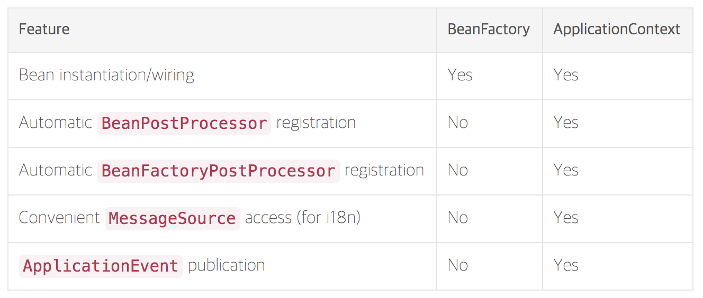

# 스프링이란?
소규모 애플리케이션 또는 기업용 애플리케이션을 자바로 개발하는데 있어 유용하고 편리한 기능을 제공하는 프레임워크    
Web servlet : spring MVC, WebSocket, SockJS, STOMP messaging    
Web reactive : web flux, webClient, webSocket   

__[디자인 철학]__
- 다양한 관점을 지향한다.
- __하위 호환성을 지키기 위해 노력한다.__
- API를 신중하게 설계한다.
- 높은 수준의 코드를 지향한다.

----
# IoC 컨테이너
0. Inversion of Control  
> 의존 관계 주입(Dependency Injection)이라고도 하며, 어떤 객체가 사용하는 의존 객체를 직접 만들어 사용하는게 아니라, 외부에서 주입 받아 사용하는 방법을 말 함
Spring이 아니더라도 가능하다.

1. IoC 컨테이너
> 최상위 중요 인터페이스 : `BeanFactory`
실질적으로 자주 사용하는 인터페이스 : `ApplicationContext`
IoC 컨테이너의 기능(BeanFactory 상속) + 추가기능(리소스 로딩, 메시지 소스 처리, 다국화, 이벤트 발행기능 등)을 가지고 있다.
(빈 반환 메서드: getBean())

- IoC 컨테이너 안에 들어있는 객체 __Bean__ 이라 부름
- application component 중앙저장소이다.
- 역할: 빈의 설정 소스로 read하고 구성하여 제공한다.(즉, bean을 만드는 역할을 함)
- 다양한 에노테이션을 사용하여 POJO객체를 빈으로 등록할 수 있다.(`@Service`, `@Repository`, `@Autowired`)

2. Bean
> Spring IoC 컨테이너가 관리하는 객체
[비교] 일반 POJO는 자바빈이다. (why? 자바 스펙에 일치하기 때문에)

3. IoC 컨테이너의 Bean으로 등록하는 이유 (장점)
- 의존성 관리: 의존성 주입을 하고 싶을 경우에 주로 사용
- 싱글톤 스코프로 등록된다.
컨테이너 내부에 만들 객체를 재사용하기 때문에 메모리를 효율적으로 사용 가능하다.
성능상에서도 이점이 된다.   
> Scope 종류 2가지
1.싱글톤 타입: 하나만 등록하여 사용 (default)
2.프로토 타입: 매번 다른 객체 사용 (request, session, protoType(매번))

- 라이프사이클 인터페이스 : `@PostConstruct`(빈 생성 후 동작)

4. 참고
__[BeanFactory vs ApplicationContext]__   



# ApplicationContext
빈 등록 방법
1. 에노테이션 기반의
- `@Component`사용하여 Bean 등록한다.
- `@Component`확장받은 에노테이션: `@Service`, `@Repository`, `@Controller`, `@Properties`등..
- 의존성 주입 에노테이션: `@Inject`, `@Autowired`

2. 자바 설정 파일을 이용한 빈 등록
- `@Configuration` 사용
```java
// Application setting
@Configuration
public class ApplicationConfig {

  @Bean
  public BookRepository BookRepository() {
    return new BookRepository();
  }

  @Bean
  public BookService BookService() {
    return return new BookService();
  }
}
// or
@Configuration
@ComponentScan(basePackageClasses = Application.class) // 해당 클래스가 위치한 곳부터 하위 패키지 ComponentScan를 한다.
public class ApplicationConfig {

}

public class Application {

    public static void main(String[] args) {
      ApplicationContext context = new
      AnnotationApplicationContext(ApplicationConfig.class);
    }
}
```
- 스프링 부트에서 알아서 해주고 있다.
`@SpringBootApplication`이 위와 같을 역할을 해주고 있다.
해당 에노테이션에 들어가면, `@ComponentScan`, `@Configuration` 설정이 되어있다.

---
# @Autowire
> 필요한 의존 객체 `타입`에 해당하는 빈을 찾아 의존성 주입을 해준다.

1. 의존성 주입

- 사용 가능한 위치 (3가지)
1. Construct (Spring 4.3부터 생략가능)
2. Setter
3. Field

- Setter를 사용한 의존성 주입
```java
@Service
public class BookService {

  BookRepository bookRepository;

  @Autowired(required = false)   // 해당 타입의 빈이 없는 경우
  public void setBookRepository(BookRepository bookRepository) {
      this.bookRepository = bookRepository;
  }
}
```
- Field를 사용한 의존성 주입
```java
@Service
public class BookService {

  @Autowired(required = false)
  BookRepository bookRepository;
}
```
생성자로 의존성 주입을 할 시 의존성주입에 실패하면, BookService의 인스턴스를 생성할 수 없다. 반면에, Setter, Field는 BookService 객체는 생성이 된다. (차이점)

2. 같은 타입의 빈이 여러개 일 때 의존성 주입 방법
- (추천) 사용 할 클래스에 `@Primary` 사용하여 해결 가능
```java
@Repository @Primary
public class BookRepository { }
```

- `@Qualifier` 사용하여 해결 가능
```java
public class BookService {

  @Autowired
  @Qualifier("bookRepository") // bean ID: small case로 작성
  BookRepository bookRepository;
}
```
- 모든 타입을 컬렉션으로 주입 받아 해결 가능

3. 동작원리
`BeanPostProcessor`
- 새로 만든 빈 인스턴스를 수정할 수 있는 라이프 사이클 인터페이스
BeanFactory가 BeanPostProcessor타입의 bean을 찾는다.
그 중 `AutowiredAnnotationBeanPostProcessor`을 찾아 일반 bean에 BeanPostProcessor를 처리한다.
`AutowiredAnnotationBeanPostProcessor`은 ApplicationContext가 default로 가지고 있다.
이러한 처리는 빈 초기화 전에 이루어진다.
> AutowiredAnnotationBeanPostProcessor extends BeanPostProcessor
- 스프링이 제공하는 `@Value` `@Autowired` 에노테이션 그리고 JSR-330의 `@Indject` 에노테이션을 지원하는 에노테이션 처리기


> Bean factory implementations should support the standard bean lifecycle interfaces as far as possible. The full set of initialization methods and their standard order is:
1. BeanNameAware's setBeanName
2. BeanClassLoaderAware's setBeanClassLoader
3. BeanFactoryAware's setBeanFactory
...
9. ApplicationContextAware's setApplicationContext (only applicable when running in an application context)
10. ServletContextAware's setServletContext (only applicable when running in a web application context)
11. __postProcessBeforeInitialization methods of BeanPostProcessors__
12. _InitializingBean's afterPropertiesSet_
13. a custom init-method definition
14. postProcessAfterInitialization methods of BeanPostProcessors

---
# ComponentScan
주요 기능
>
스캔할 위치를 지정할 수 있다.
스캔하는 중에 일부 클래스등 필터링이 가능하다.

0. 컴포넌트 스캔이 되는 대상
`@Component`
- `@Repository`
- `@Service`
- `@Controller`
- `@Configuration`

1. 스캔 위치 설정
`@ComponentScan` 설정한 내부 패키지 모두 스캔한다.
- basePackages : 문자열
- basePackagesClasses : 클래스 명 (타입세이프)

2. filter (excludeFilters, includeFilters...)
```java
@ComponentScan(excludeFilters = { @Filter(type = FilterType.CUSTOM, classes = TypeExcludeFilter.class),
		@Filter(type = FilterType.CUSTOM, classes = AutoConfigurationExcludeFilter.class) })
```

3. 펑션을 사용한 빈 등록
```java
@SpringBootApplication
public class SpringBootMvcApplication {

    public static void main(String[] args) {
        SpringApplication application = new SpringApplication(SpringBootMvcApplication.class);
        application.addInitializers((ApplicationContextInitializer<GenericApplicationContext>)
                ctx -> ctx.registerBean(MyService.class));
        application.run(args);
    }
}
```

4. 구동원리
실제 스캐닝은 `BeanFactoryPostProcessor`을 구현한 `ConfigurationClassPostProcessor`를 이용한다.
다른 빈들을 만들기 이전에 `BeanFactoryPostProcessor` 처리한다.

---
# Bean scope
- 싱글톤 (default): ApplicationContext 초기 구동시 인스턴스 한번만 생성한다
- 프로토타입: Request, Session, WebSocket ...
```java
@Component @Scope("prototype")
public class Proto {

}
```

프로토타입 빈이 싱글톤 빈을 참조하면 아무 문제가 없다.   
if) 싱글톤 빈이 프로토타입 빈을 참조하면?   
싱글톤은 인스턴스 한번만 생성하기 때문에, 참조한 프로토 타입이 변경이 되지 않는다.   
해결방법 3가지    
1. scoped-proxy
클래스 기반의 프록시 생성하여 해당 프록시를 사용한다.
```java
@Service @Scope(value = "prototype", proxyMode = ScopedProxyMode.TARGET_CLASS)
public class Proto {

}
```
2. Object-Provider
3. Provider (표준)

---
# ApplicationContext의 여러가지 기능
```java
  public interface ApplicationContext extends             EnvironmentCapable,   
    ListableBeanFactory,
    HierarchicalBeanFactory,
    MessageSource,
    ApplicationEventPublisher,
    ResourcePatternResolver { ... }
```

# ApplicationContext : Environment 기능
> `EnvironmentCapable`
프로파일과 프로퍼티를 다루는 인터페이스

### 프로파일
1. 프로파일
- 빈들의 그룹
- Environment의 역할은 활성화할 프로파일 확인 및 설정
- getEnvironment()

2. 프로파일 정의
- 클래스에 정의: `@Configuration`, `@Profile("test")`
- 메소드에 정의: `@Bean`, `@Profile("test")`

3. 프로파일 표현식
- `!` (not)
- `&` (and)
- `|` (or)

### 프로퍼티
- 다양한 방법으로 정의할 수 있는 설정 값
- key, value로 이루어짐
- 우선순위 존재한다

- `@PropertySource("classpath:/application.properties")` : Environment를 통해 프로퍼티 추가하는 방법

```java
Environment environment = cts.getEnvironment();
environment.getProperty("key name"); //
```

# ApplicationContext : MessageSource
- 국제화(i18n)기능을 제공하는 인터페이스

ApplicationContext extends MessageSource
- getMessage(String code, Object[] args, String default, Locale, loc)

- 스프링 부트 메세지 소스 파일 이름 : `messages.properties`, `messages_ko_KR.properties`...

- 릴로딩 기능이 있는 메시지 소스 설정
```java
@Bean
public MessageSource messageSource() {
        ReloadableResourceBundleMessageSource messageSource = new ReloadableResourceBundleMessageSource();
        messageSource.setBasename("classpath:/messages");
        messageSource.setDefaultEncoding("UTF-8");
        messageSource.setCacheSeconds(3);
        return messageSource;
}
```

# ApplicationEventPublisher


---

[백기선 스프링 핵심기술]
[이미지 출처](http://wonwoo.ml/index.php/post/1571)
