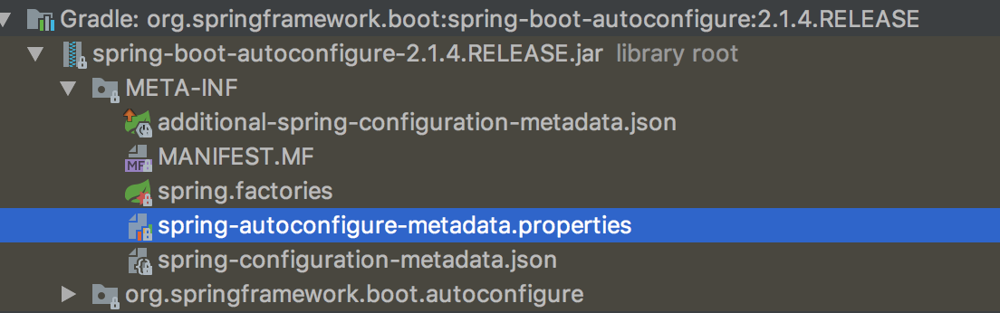
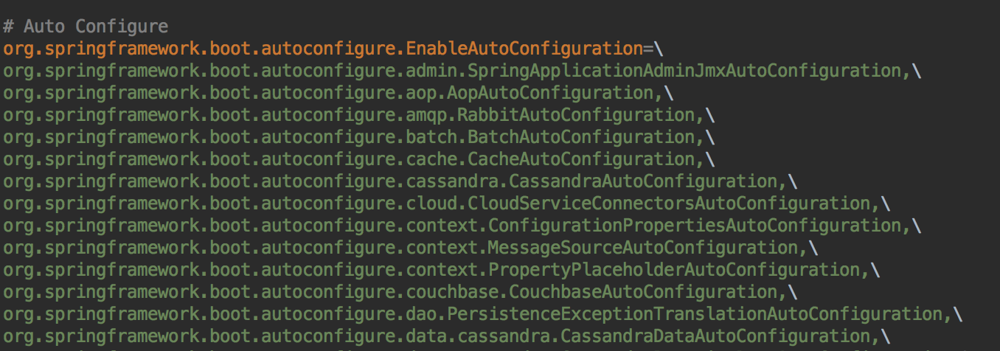
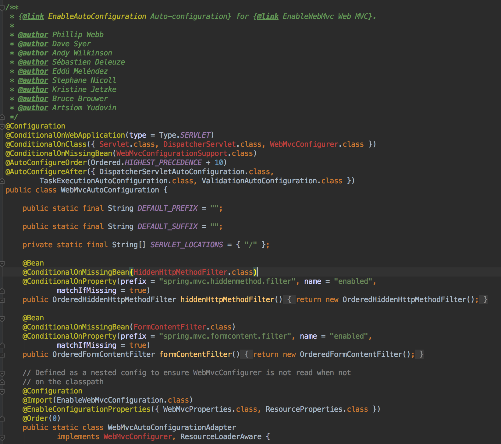

#자동 설정 이해
일반적으로 Autoconfigure, starter 모듈을 따로 분리하여 재정의하고 의존성에 추가하는 방식으로 많이 개발하고 있다.

### Goals
- 먼저 메인 클래스에서 보통 사용되는 `@SpringBootApplicaion`의 동작원리를 알아본다.
- 추가한 의존성 jar이 Spring application에 어떤 방식을 자동으로 설정되는지 알아본다.

---
### @SpringBootApplicaion
@SpringBootApplicaion은 `@SpringBootConfiguration, @ComponentScan, @EnableAutoConfiguration`와 동일하다.
(자동설정은 @SpringBootApplicaion 이나 @EnableAutoConfiguration를 추가하면 되긴한다. [참고](https://docs.spring.io/spring-boot/docs/current/reference/htmlsingle/#using-boot-auto-configuration))

~~~ java
//@SpringBootApplication
// 동일
@SpringBootConfiguration
@ComponentScan
@EnableAutoConfiguration
public class SpringBootGettingStartedApplication {
    public static void main(String[] args) {
        SpringApplication springApplication = new SpringApplication(SpringBootGettingStartedApplication.class);
        springApplication.run(args);

//      SpringApplication.run(SpringBootGettingStartedApplication.class, args);
    }
}
~~~

##### @SpringBootApplicaion을 타고 들어가면 아래 3가지 애노테이션이 보인다.        
> @SpringBootConfiguration
> @Component
> @EnableAutoConfiguration (자동설정하는 애노테이션)

##### @SpringBootApplicaion은 Bean 설정할 시 2단계로 나눠서 등록을 한다.
> 1단계 : @ComponentScan
> 2단계 : @EnableAutoConfituration

###### 1단계 @ComponentScan        
Spring beans을 등록하고 의존성 주입시킨다.
* @Component
* @Configuration @Repository @Service @Controller @RestController

>If you structure your code as suggested above (locating your application class in a root package), you can add @ComponentScan without any arguments. All of your application components (@Component, @Service, @Repository, @Controller etc.) are automatically registered as Spring Beans.

###### 2단계  @EnableAutoConfiguration
@EnableAutoConfiguration를 역할을 알아보자.
spring-boot-autoconfigure library에 META-INF > Spring.factories 파일을 참고하자.
spring.factories는 key, value로 이루어져 있으며, value값을 여러개 등록할 수 있다.
`org.springframwork.boot.autoconfigure.EableAutoConfiguration`를 보면 자동으로 AutoConfiguration할 클래스 목록이 나열되어있다.
EableAutoConfiguration 중 아무거나 타고 들어가면, `@Configuration` 애노테이션이 설정되어 있는 것을 알 수 있다.
<em>`@AutoConfiguration은 자동으로 등록할 클래스 리스트를 담고 있고(spring.factories), @configuration 클래스들을 bean으로 등록, 설정한다`</em>

<spring-boot-autoConfigure library 구조>

<spring.factories 일부>

##### Tip! Library configuration 설정에서 많이 발견되는 애노테이션        
@Configuration      
@ConditionalOnXxxYyyZzz
- @ConditionalOnWebApplication(type = Type.SERVLET) : WebApplication 타입이 SERVLET일 때 등록한다.
- @ConditionalOnMissingBean(WebMvcConfigurationSupport.class) : WebMvcConfigurationSupport.class 클래스가 없을 때
@Order(n) : bean 등록, 설정 시 순서를 정할 수 있다. (n은 숫자, 낮을수록 빠르다)

<EnableAutoConfiguration하는 클래스 중 하나 : WebMvcAutoConfiguration >

-----

### Quiz
#### 1. @ComponentScan 후 @EnableAutoConfiguration이 돌아가면서 기존에 내가 등록한 빈설정이 @EnableAutoConfiguration에 의해 덮어지게 된다. 이 때 해결방법 무엇일까?
@SpringBootApplicaion은 bean을 @ComponentScan, @EnableAutoConfituration 2단계로 나눠서 등록한다. @ComponentScan 이후, @EnableAutoConfiguration이 실행한다. 기존에 커스텀마이징한 bean 설정은 ComponentScan에서 등록되는데 이후에 실행되는 @EnableAutoConfiguration 이 설정을 덮어쓰기 때문에 커스텀마이징이 불가능하게 된다.

1. library configuration에 `@ConditionalOnMissingBean`을 사용하면 해결할 수 있다.
2. 빈 재정의 수고 덜기 : 프로퍼티 키값으로 자동으로 설정되도록 한다.        
@ConfigurationProperties(“holoman”)
@EnableConfigurationProperties(HolomanProperties)
~~~xml
<dependency>
        <groupId>org.springframework.boot</groupId>
         <artifactId>spring-boot-configuration-processor</artifactId>
        <optional>true</optional>
</dependency>
~~~
