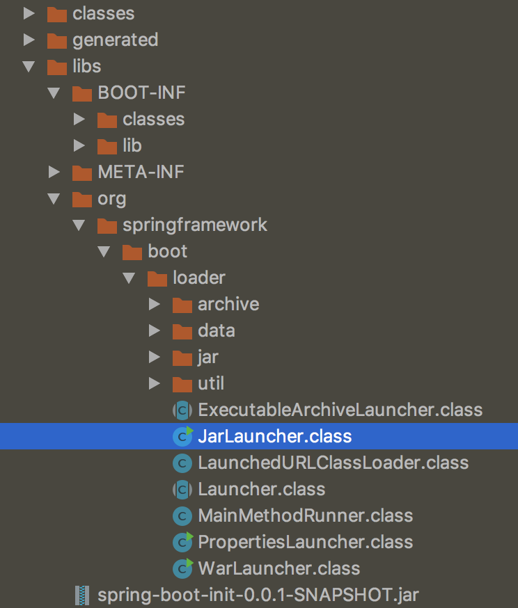

# 독립적으로 실행 가능한 JAR

https://docs.spring.io/spring-boot/docs/current/reference/html/executable-jar.html

과거 `uber`를 사용할 때는 모든 클래스(의존성,애플리케이션)을 하나로 압축하여 1개의 jar파일로 만들었다. 그렇기 때문에 당연히 애플리케이션, 테스트 코드 분별이 어려웠고 무슨 라이브러리르리 사용하는 지 알 수 없었다.
이에 SpringBoot은 다음과 같은 `내장 JAR 사용` 전략을 세웠다.

~~~
// jar file
+- BOOT-INF     				// 1번
	+- classes
	+- lib
+- org.springframwork.boot.loader		// 2번
	+- archive
	+- data
	+- jar
	+- util
	+- JarLauncher.class  		//  내장 jar파일을 읽는 클래스
	+- Launcher.class 		//  Main class를 실행하는 클래스
	+- MainMethodRunner.class
	+- PropertiesLoauncher.class
	+- WarLauncher.class
	...
~~~
1. 기존에 의존성 라이브러리와 애플리케이션을 통합하여 관리하였다. SpringBoot는 애플리케이션과 library 위치를 구분하여 만든다. 
2. 자바에서는 내장 jar를 로딩하는 표준적인 방법이 없다. SpringBoot는 jar파일을 읽는 loader를 만들어서 내장 jar 파일을 읽어낸다.
<em>JarLauncher, PropertiesLoauncher, WarLauncher 등 메인 클래스를 실행하는 방법은 다양하다.</em>

> 정리
기존(uber)방식은 애플리케이션,의존성을 하나로 압축하여 관리하였다.
SpringBoot는 내장 jar를 사용하여 애플리케이션과 의존성이 구분 가능하게 하였다.
자바에서는 내장 jar를 로딩하는 표준방법이 없어, jar loader를 만들어 내장 jar 파일을 읽을 수 있다.
메인 클래스를 실행하는 방식은 jarLauncher, propertiesLoauncher등 다양하다.
