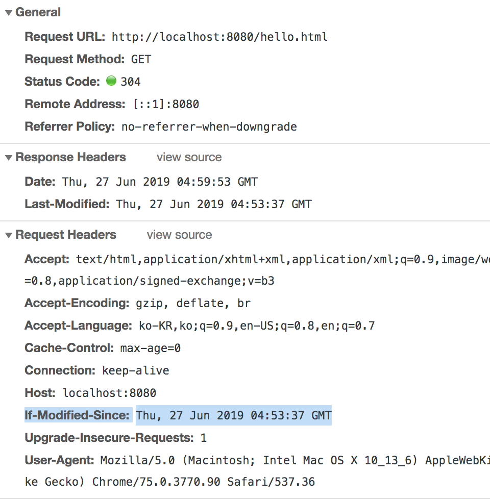

# Spring web MVC
## 1. HttpMessageConverters
[Spring reference 참고](https://docs.spring.io/spring/docs/5.0.7.RELEASE/spring-framework-reference/web.html#mvc-config-message-converters)

- Spring framework에서 제공하는 인터페이스 spring mvc의 일부분
- Http 요청 본문으로 들어오는 것을 객체로 바인딩하거나, 객체를 응답 본문으로 변환할 때 사용   
- __주요 사용되는 어노테이션 2가지__ : `@RequestBody`, `@ResponseBody`

HttpMessageConverters는 여러 종류가 있다.    
사용되는 MessageConverter는 다양하며 어떤 요청을 받았는지 어떤 요청을 보내야 하는지에 따라 사용되는 MessageConverter가 달라지게 된다.
> Tip 1-1
contentType : 요청하는 타입
accept      : 어떠한 타입의 본문을 원한다고 서버에게 알리는 것

> Tip 1-2
Default : 컴포지션 타입 일 경우 JsonMessageConverter 사용
String > StringMessageConverter 사용
int > StringMessageConverter 사용

- TestCode : JSON요청했을 때, Json으로 반환한다.
```java
  @Test
  public void createUser_Json() throws Exception {
       String userInfo = "{\"username\":\"juju\",\"password\":\"123\"}";
       mockMvc.perform(post("/user/create")
                 .contentType(MediaType.APPLICATION_JSON)       // spring framework
                 .accept(MediaType.APPLICATION_JSON_UTF8)       // response 응답을 원하는 타입
                 .content(userInfo))
               .andExpect(status().isOk())
               .andExpect(jsonPath("$.username", is(equalTo("juju"))))
               .andExpect(jsonPath("$.password", is(equalTo("123"))));
   }
```
---
## 2. View resolver
spring boot가 제공하는 `ContentNegotiatingViewResolver` 설정
뷰 리졸버 중 하나로 들어오는 요청에 `accept header`에 따라 response가 달라진다.
> accept header란? 어떠한 타입의 본문을 원한다라고 서버에게 알리는 것

요청을 응답을 해결할 수 있는 모든 뷰를 찾아낸다. 타입을 비교하여 최종적으로 선택한다.   
경우에 따라서는 accept 사용하지 않고, format parameter를 사용해서 하긴한다.   
ex)/path?format=pdf

스프링 부트는 뷰 리졸버 설정을 default로 제공하고 있다.  __참고 : `HttpMessageConvertersAutoConfiguration`__

- XML MessageConverter setting
HttpMessageConvertersAutoConfiguration를 보면 뷰 리졸버 설정을 default로 해준다.
해당 클래스의 JacksonHttpMessageConverterConfiguration.class
```java
	@Configuration
	@ConditionalOnClass(XmlMapper.class)
	@ConditionalOnBean(Jackson2ObjectMapperBuilder.class)
	protected static class MappingJackson2XmlHttpMessageConverterConfiguration {

		@Bean
		@ConditionalOnMissingBean
		public MappingJackson2XmlHttpMessageConverter mappingJackson2XmlHttpMessageConverter(
				Jackson2ObjectMapperBuilder builder) {
			return new MappingJackson2XmlHttpMessageConverter(builder.createXmlMapper(true).build());
		}

	}
```
를 보면 XmlMapper 클래스가 존재해야 xml 뷰리졸버 설정이 된다는 것을 알 수 있다.
간단한 의존성 추가로 해결이 가능하다.
```
compile 'com.fasterxml.jackson.dataformat:jackson-dataformat-xml:2.7.5'
```
- Test code
```java
    @Test
    public void createUser_xml() throws Exception {
        String userJson = "{\"username\":\"juju\",\"password\":\"123\"}";
        mockMvc.perform(post("/user/create")
                .contentType(MediaType.APPLICATION_JSON)    // spring framework
                .accept(MediaType.APPLICATION_XML)       // response 응답을 원하는 타입
                .content(userJson))
                .andDo(print())
                .andExpect(status().isOk())
                .andExpect(xpath("/User/username").string("juju"))
                .andExpect(xpath("/User/password").string("123"));
    }
```
---
## 3. Static resources
정적 리소스 : 동적으로 생성하지 않는 것, 이미 만들어져 있는 리소스를 제공하는 방법      
`ResourceHttpRequestHandler`가 처리를 하고 있다.

정적 리소스 맵핑 : `/**`
- 기본 리소스 위치
  - classpath:/static
  - classpath:/public
  - classpath:/resources/
  - classpath:/META-INF/resources

- spring.mvc.static-path-pattern: 맵핑 설정 변경 가능
- spring.mvc.static-locations: 리소스 찾을 위치 변경 가능
> 위 방법은 권고하지 않는다. 기본 리소스 설정을 사용이 어렵기 때문
WebMvcConfigurer를 사용하는 것을 추천한다.


- 작동 원리 및 실행 결과

304 응답을 보내고 있다. 정적 리소스는 매번 다시 받아오는 것이 아니다.
요청 시 `if-Modified-Since`의 시간 이후에 변경사항이 있으면(`Last-modified`와 비교) response 해준다.
코드 변경 후 응답 결과를 보면 200을 받는 것을 확인할 수 있다.

 `if-Modified-Since`와 `Last-modified`를 비교해서 보자

- if) resouces 설정 커스텀 마이징하고 싶다면? `WebMvcConfigurer`
WebMvcConfigurer의 addRersourceHandlers로 기존 설정에 추가가 가능하다.    
```java
@Configuration
public class WebConfig implements WebMvcConfigurer {
    @Override
    public void addResourceHandlers(ResourceHandlerRegistry registry) {
        registry.addResourceHandler("/m/**")
                .addResourceLocations("classpath:/m/")  // 반드시 /로 끝나야한다
                .setCachePeriod(20);
    }
}
```
---
## Web JAR
- Client에서 사용하는 javascript library (jQuery, bootstrap, reactjs, viewjs ..)

- web jar mapping :  `/webjars/**`
- 버전 생략하고 사용하고 싶다면 의존성을 추가하자 ? `webjars-locator-core`     
- Example Code
```javascript
<script src="/webjars/jquery/dist/jquery.min.js"></script>
<script>
   $(function() {
       console.log("ready!");
   });
</script>
```
---
## welcome page and favicon
1. welcome page 설정
- index.html 찾아 보고 있으면 제공.
- index.템플릿 찾아 보고 있으면 제공.
- 둘 다 없으면 에러 페이지.
3. favicon : favicon.ico
- [favicon 만드는 사이트](https://favicon.io/)
- [favicon 안 바뀔 때](https://stackoverflow.com/questions/2208933/how-do-i-force-a-favicon-refresh)

---
## Thymeleaf
- 템플릿 엔진 : 뷰, 코드 제너레이션, 이메일 템플릿등 사용가능
템플릿은 같으나 들어가는 값들만 변경이 된다. 이런 경우 동적페이지를 사용한다.

- 스프링 부트가 자동 설정을 지원하는 템플릿 엔진 종류
`FreeMarker`, `Groovy`, `Thymeleaf`, `Mustache`

- __JSP를 권장하지 않는 이유__
spring boot는 독립적으로 실행가능한 임베디드 톰캣으로 애플리케이션으로 빠르게 배포하기를 지향한다.
JAR 패키징 할 때는 동작하지 않고, WAR 패키징 해야 함.
__Undertow는 JSP를 지원하지 않음.__
(의존성 문제도 발생할 수 있어요..)
[참고](https://docs.spring.io/spring-boot/docs/current/reference/htmlsingle/#boot-features-jsp-limitations)

- 사용 방법
1. 의존성 추가: spring-boot-starter-thymeleaf   
2. 템플릿 파일 위치: /src/main/resources/template/    
[공식 홈페이지](https://www.thymeleaf.org/)
[사용방법](https://www.thymeleaf.org/doc/articles/standarddialect5minutes.html)
[예제](https://github.com/thymeleaf/thymeleafexamples-stsm/blob/3.0-master/src/main/webapp/WEB-INF/templates/seedstartermng.html)

> Thymeleaf를 사용하기 때문에 가능한 것
JSP는 데이터 랜더링을 servlet engine이 해주고 있기 때문에 데이터 랜더링 된 최종 뷰를 검증, 확인하기 힘들다. (특히, 테스트에서는 mocking한 servlet container를 작동시키고 이에 관련 기능은 들어가있지 않아 테스트 또한 쉽지 않다.)
이에, 타임리프는 servlet engine없이 독자적으로 랜더링하고 최종 뷰를 완성하기 때문에 데이터 랜더링된 결과를 확인할 수 있다.

---
## HtmlUnit
HTML 템플릿 뷰 테스트를 보다 전문적으로 하고 싶다면 Html Unit을 사용
`@Autowire WebClient`을 사용
[공식 사이트](http://htmlunit.sourceforge.net/)
[사용방법](http://htmlunit.sourceforge.net/gettingStarted.html)
- 의존성 추가
```
<dependency>
   <groupId>org.seleniumhq.selenium</groupId>
   <artifactId>htmlunit-driver</artifactId>
   <scope>test</scope>
</dependency>
<dependency>
   <groupId>net.sourceforge.htmlunit</groupId>
   <artifactId>htmlunit</artifactId>
   <scope>test</scope>
</dependency>
```
---
##스프링 @MVC 예외 처리 방법

`@ControllerAdvice`, `@ExceptionHandler`

- 스프링 부트가 제공하는 기본 예외 처리기 : `BasicErrorController`
HTML과 JSON 응답 지원한다.

- 커스터마이징 방법
`BasicErrorController` 구현

- 커스텀 에러 페이지
상태 코드 값에 따라 에러 페이지 보여주기   
src/main/resources/static|template/error/   
--- 404.html        
--- 5xx.html      

---
