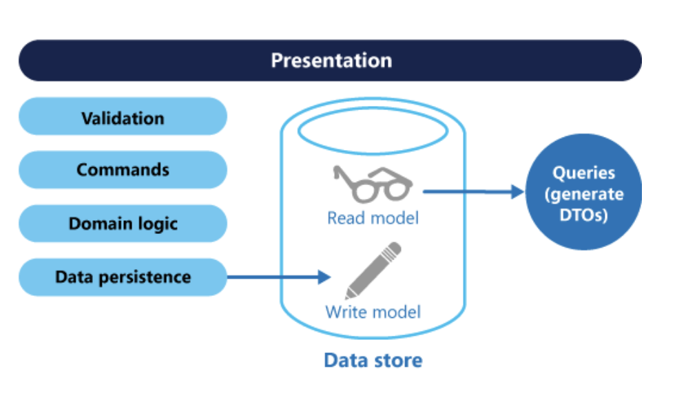
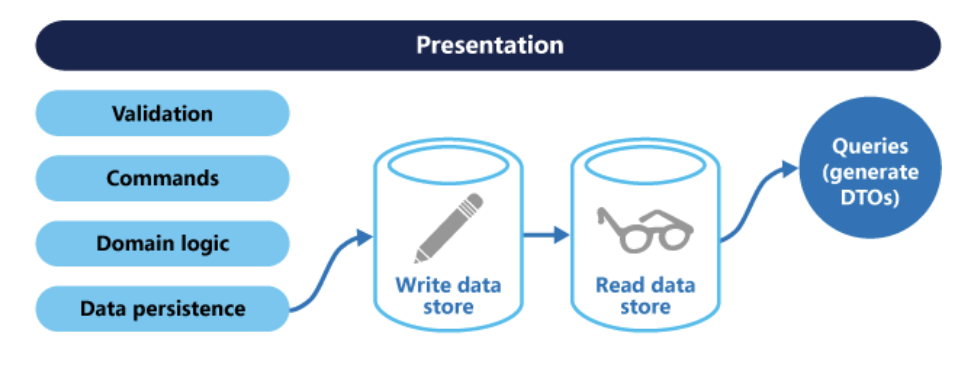

# CQRS(Command and Query Responsibility segregation)
> 엔터프라이즈 환경 or 클라우드 환경에서 사용하는 아키텍처 패턴 중 하나
> In an oversimplified manner, CQRS separates commands (that change the data) from the queries (that read the data).
– Rinat Abdullin from CQRS Starting Page
요약 : 명령, 쿼리의 역할을 분리
커맨드 : Command: Create, Update, Delete
쿼리 : Select : Read

하나의 데이터베이스 안에서 CRUD의 R에 해당하는 기능과 나머지 CUD 기능을 공존시키는 것이 의미가 없다.
R은 캐쉬로 돌려 사용자들이 빠르게 읽어들일 수 있도록 함 (localcache... )
CUD는 메시지 큐를 통해 실제 데이터를 변경 시키고, 변경이 일어나는 시점에 이벤트를 발생시켜 캐쉬를 업데이트 하는 방식으로 진행

#### 방법1. 단일 Data store에 command, query model을 분리된 계층으로 나누는 방식
RDBMS는 분리하지 않고 기존 구조 그대로 유지 시키고 model layer 부분만 command, query model로 분리하는 수준으로 간단하게 적용할 수 있다.
단점 : 동일 database을 사용함으로 성능상 문제점을 개선하지 못한다.

#### 방법2. command, query 용 database를 분리하고 별도의 Broker를 통해 둘 간의 data를 동기화 처리하는 방식

데이터 조회하려는 대상 서비스들은 각자 자신의 서비스에 맞는 저장소를 선택할 수 있기 때문에 폴리글랏 저장 구조로 구성할 수도 있다.
장점 : Model에 맞게 RDBMS, NoSQL, Cache를 튜닝하여 사용할 수 있다.
방법1의 단점인 동일 database를 사용에 성능 관점 문제를 해결 할 수 있다.
하지만, 동기화 처리를 위한 broker의 가용성과 신뢰도가 보장되어야 하는 risk가 존재한다.

#### 방법3. 이벤트 소싱(EventSourcing)을 적용한 구조

Application내 모든 activity를 이벤트로 전환하여 이벤트 스트림(Event stream)을 별도의 database에 저장하는 방식
이벤트 스트림을 저장하는 database에는 데이터 추가만 가능하다. 쌓인 데이터를 구체화(Materialized) 시키는 시점에서 그때 까지 구축된 데이터를 바탕으로 조회대상 데이터를 작성하는 방법이다. 

이벤트 소싱의 이벤트 스트림은 오직 추가만 가능하고 필요로하는 시점에서 구체화 단계를 거치게 되고 이런 처리 구조가 CQRS의 Model 관점과 굉장히 잘 맞기에 CQRS패턴을 적용하고자 할 때 이벤트 소싱이 적용된 구조를 선택한다

__ CQRS패턴에 이벤트 소싱은 필수가 아님.
이벤트 소싱에 CQRS는 필수이다__

> 폴리글랏 저장소 : 다수의 database를 혼용하여 사용하는 것

https://www.popit.kr/cqrs-eventsourcing/

https://blog.aliencube.org/ko/2015/11/12/building-applications-on-cloud-with-event-sourcing-pattern-and-cqrs-pattern/
