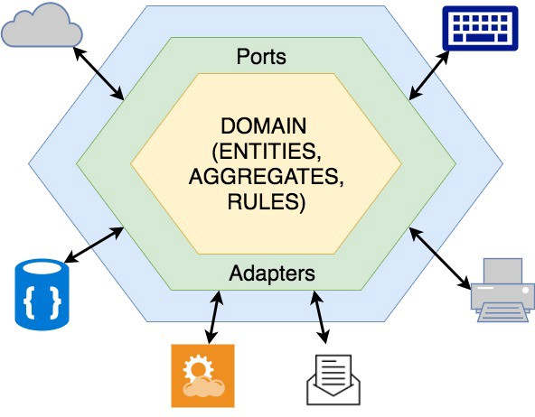

# 모듈
> Java = package
> C# = namespace
> Ruby = module

## 로드맵
- `전통적인 모듈`, `배포 모듈성`의 차이점
- 모듈 이름을 `유비쿼터스 언어`로 작성할 경우 장점
- 기계적인 모듈 설계를 할 경우 도달하는 결과와 단점을 알아본다.
- 앞에서 설명한 이론을 __사스오베이션 팀__ 예제를 통해 이해해보자.
- __도메인 모델 밖에서 모듈이 수행하는 역할__ 과,
 새로운 바운디드 컨텍스트보다 `새로운 모듈을 도입해야하는 시점`이 언제인지 알아본다.

 ? __도메인 모델 밖에서 모듈이 수행하는 역할__

 ---
## 모듈 설계하기
올바르게 모듈을 설계하기 위해 중요시 해야하는 부분 3가지
1. __모듈 내부__ 에서의 객체는 __높은 응집도를 갖고 있는 도메인을 객체를 담고 있는 컨테이너 역할__ 을 해야한다.
(= 도메인 객체와 연관된 이름을 가진 컨테이너)
2. 각 `모듈`끼리는 클래스 사이에 __낮은 결합도__ 를 유지하도록 노력한다.
3. __모듈명은 유비쿼터스 언어를 사용하여 정한다.__

#### [모듈 설계의 간단한 규칙]
##### 지향하는 것
1. 모델링 개념에 맞춰 모듈 설계
- 일반적으로 1개 이상의 애그리게잇 모듈을 가진다.
2. 모듈명은 유비쿼터스 언어를 이용하여 작성한다.
- DDD의 목적이기도 하며, 지금까지 학습한 것을 기반으로 생각하면 자연스레 도출되는 결과라 생각한다.
3. 모듈은 느슨하게 결합하도록 설계한다.
- 모듈 사이의 독립성을 보장할 경우, __느슨하게 결합된 클래스__ 와 같은 이점을 가질 수 있다.    
- 이에따라오는 장점
  - 리팩토링 하기 쉬움    
  - 이미 모듈화 되었기 때문에, OSGi나 직소(java 9)와 같은 모듈화 장치 도입이 쉬워진다. (아래에서 조금 더 자세히 다룬다.)    

###### 지양하는 것
1. 일반적인 컴포넌트 타입, 패턴을 사용한 __기계적인 모델__ 을 생성 금지
- 하나의 모듈로 각각 분리할 경우, 모듈화의 장점을 취할 수 없다.    
```
.
+-- config
+-- properties    
+-- controller   
+-- entity        
+-- model         
+-- service   
+-- factory  
+-- application
+-- repository
```

모듈의 모델을 정적인 개념에 따라 만들지 말고, 모듈이 담고있는 `객체`에 초점을 맞춘다.    
- 모델이 시간적 흐름에 따라 행동, 이름이 변경된다면 애초에 이름이 잘못되었다는 신호이다.
이름이 맞지 않다는 신호를 받았다면 리팩토링을 하자.   

결합이 필요할 경우, 짝이 되는 모듈 사이에 `비순환적 의존성`이 형성되도록 노력한다.    
- 모듈간의 완전히 독립하기에는 거의 불가능하며, 실용적이지도 않음
- 해결방법(저자가 권고하는 방향)
  - __두 모듈간의 의존성을 단방향으로 만들경우, 커플링을 주일 수 있다.__

부모 모듈과 자식 모듈 사이의 규칙은 느슨하게 한다.
- 부모와 자식모듈 간의 의존성을 방지하는 것은 매우 어렵다.
- 해결방법(저자가 권고하는 방향)
  - __비순환적 의존성을 갖도록 노력한다.__
  - __비순환적 의존성이 불가능 할 경우, 순환적 의존성을 허용하도록 한다.__
   ex)자식은 식별자를 통해서만, 부모 참조 가능하다    

_애자일 프로젝트 관리 컨텍스트의 모듈(p.441)에서 예제를 들며 위 두가지의 해결방안으로 풀어낸 것을 설명하고 있다._    

#### 모듈 설계하기 정리...    
- 가장 중요한 구성 요소(first-class citizen : entity, value object, event)등에서 그랬듯 모듈의 이름을 의미있는 이름으로 작성하도록 하자.    
(새로운 모듈 생성 시, 기존 모듈명을 변경할 수 있다라는 의미도 된다.)
__배포 단위로 패키지하는 방법__   
- Jar파일을 배포의 단위로 생각하지만, 새로운 접근법에 따르면 버전에 따라 조립할 수 있다. ex) OSGi 번들, 직소   
- 다양한 상위 수준 모듈, 버전, 각각의 의존성을 번들/모듈에 의해 관리할 수 있다.    

>[OSGI(Open Service Gateway initiative)](https://ko.wikipedia.org/wiki/OSGi)
 응용 프로그램의 생명주기(Life cycle) 모델과 서비스 레지스트리(Service Registry)를 정의하는 프레임워크(Framework)이다.
동적인 SOA(Service Oriented Architecture) 기반의 컴포넌트 모델을 구현한다.
번들은 재시동 과정 없이 원격지를 통해 설치, 시작, 정지, 업데이트, 제거를 할 수 있다.

---
## 기본 모듈 명명규칙
> 자꾸 이름이 중요하다고 하는데...
Java, C# 모두 모듈 이름을 계층적 형태를 반영한다.
(해당 계층의 단계는 `.`(dot)으로 구분한다.)

- 이름의 계층은 일반적으로 생성한 `조직의 이름`이 `인터넷 도메인`과 조합하여 시작한다.
```
com.vroong // Java
vroong     // C#
```
> [Package Naming Conventions](https://docs.oracle.com/javase/specs/jls/se8/html/jls-6.html#jls-6.1)
Developers should take steps to avoid the possibility of two published packages having the same name by choosing unique package names for packages that are widely distributed.This section specifies a suggested convention for generating such unique package names. Implementations of the Java SE platform are encouraged to provide automatic support for converting a set of packages from local and casual package names to the unique name format described here.
...
You form a unique package name by first having an Internet domain name, such as oracle.com. You then reverse this name, component by component, to obtain, in this example, com.oracle, and use this as a prefix for your package names, using a convention developed within your organization to further administer package names. Such a convention might specify that certain package name components be division, department, project, machine, or login names.
- 일관성을 유지하는 편이 가장 좋다.
- 이로 인해 얻을 수 있는 점
  - 써드파트 모듈과 네임스페이스 충돌 방지
---

사스오베이션 팀의 사례를 예시로 설명한다.         
### 모델을 위한 모듈 명명 규칙     
바운디드 컨텍스트를 기반으로 하여 이름을 짓는 것은 좋은 시도이다.       

```
// !! 네이밍 중점으로 비교
// 바운디드 켄텍스트 기반으로 모듈나눈 경우
.
+-- com
  +-- saaasovation
    +-- identityaccess
    +-- collaboration
    +-- agilepm

// 상품 이름, 팀명을 사용한 경우  
.
+-- com
  +-- saaasovation
    +-- idovation
    +-- collabovation
    +-- productovation
```
- `바운디드 컨텍스트를 기준`으로 나누는 것이 바람직하다.   
- `상품 이름, 팀명을 사용한 경우` 시간의 흐름에 따라 변경될 가능성이 높다. -> 결과 : 변경 될 경우 모듈명이 의미가 없어짐    

```
.
+-- com
  +-- saasovation
    +-- identityaccess
      +-- domain    // vo, entity, event ...
        +-- model   // domain service

    +-- collaboration
      +-- domain  
        +-- model

    +-- agilepm
      +-- domain
        +-- model    
        +-- service  
```
- `domain`
  - domain 패키지에는 인터페이스, 클래스가 없다.
  - __빈 컨테이너 역할__ 만을 수행하며, 모델은 하위 계층(`model`)에 생성한다.
  - `model`
    - `domain` 하위 계층이다.
    - 클래스, 인터페이스, 추상클래스 포함한다.
    - 예시) Entity, DomainEvent, DomainPublisher, DomainSubscriber, DomainRegistry, ValueObject, DomainObject
  - `service`
    - `domain` 하위 계층이다.
    - 도메인 서비스 계층을 따로 두고 싶은 경우 사용한다.
    - 애너믹 도메인 모델이 되지 않도록 주의한다.
    - 저자는 `service` 계층을 두는 것을 권고한다.

###### 애자일 프로젝트 관리 컨텍스트의 모듈  
```
.
+-- com
  +-- saasovation
    +-- agilepm
      +-- domain
        +-- model    
          +-- tenant
            +-- TenantId.class  
              // 의존성이 많음 -> tenant 모듈은 다른 대상에 의존하지 않도록 비순환적으로 해결
          +--  team
            +-- Team.class
            +-- ProductOwner.class
            +-- TeamMember.class
          +-- product
            +-- backlogitem
            +-- release
            +-- sprint        
```
`product`안에서 3가지의 모듈을 나눈 이유?        
__모듈 사이의 결합도보다 정리에 중점을 두었기 때문이다.__    
같은 애그리게잇의 다른 부분을 서술하지 않아 적게보여 불필요하게 느껴질 수 있다.   
각 애그리게잇(backlogitem, release, sprint)마다 그에 관련된 값 객체, 엔터티, 도메인 이벤트가 있으면 크기가 굉장히 커질 것이다.      
모듈을 둠으로 써 정리가 잘된 느낌을 풍긴다. (포크,나이프를 생각하세요!)    

---
### 다른 계층 속의 모듈
전형적인 계층형 아키텍처의 계층
- 사용자 인터페이스
- 애플리케이션
- 도메인
- 인프라

##### 사용자 인터페이스 계층
사용자 인터페이스 계층과 레스트풀 리소스의 지원에 따른 영향을 기반으로 설명한다.   
- 리소스 : xml, json, html등을 이용하여 표현상태를 만들어 GUI, 시스템 클라이언트에게 서비스 제공 할 수있다.
- 레스트풀 리소스
  - __프레젠테이션 레이아웃을 포함하면 안된다.__
  - 다양한 마크업(xml,html)과 직렬화 포맷(xml, json, protocol buffer)으로 작성한다.
- 표현에 관련한 순수 관심사는 __하위 패키지(`view`,`presentation`)에서 관리__ 한다.

```
.
+-- com
  +-- saasovation
    +-- agilepm
      +-- resource
        +-- presentation  // = view
```

##### 애플리케이션 계층
애플리케이션 계층에서는 다른 모듈을 포함할 수 있다.   
각 모듈마다 하나의 서비스 타입을 다루도록 구성 할 수 있다.    
애플리케이션 계층의 서비스는 도움이 될 경우에만 하위 모듈로 나눈다.    
```
+-- com   
  +-- saasovation
    +-- agilepm
      +-- application
        +-- team
        +-- product
        +-- tenant
```

---
### 바운디드 컨텍스트보다 모듈
도메인 모델 객체를 여러 모델로 나눌지, 하나로 유지할지에 대한 고민은 신중해야한다.   
용어가 애매하고 컨텍스트 경계가 뚜렷하게 나뉘지 않은 경우, 나누지 않고 하나로 유지하자.    
대신 __모듈__ 로 경계를 표현하자.   
__응집도 높은 도메인 객체를 모듈화하고 응집력이 없거나 낮은 객체를 분리하기 위해 모듈을 사용하자__   

---
애플리케이션 아키텍처 정리    
- 전통적인 아키텍처 : identityaccess
- 헥사고날 아키텍처 : agilepm
```
.
+-- com // 인터넷 도메인
  +-- saasovation // 팀명
    +-- collaboration
    +-- identityaccess  // 바운디드컨텍스트 기준으로 모듈 나눔
      +-- domain
        +-- model     // entity, value object, domainPublisher, repository, factory ...
        +-- service   // domain event
      +-- application
        +-- presentation  // = dto
      +-- infrastructure
      +-- resource        // = controller

    +-- agilepm
      +-- domain
        +-- model
          +-- team
          +-- product
          +-- tenant
          ...
      +-- application
        +-- team
        +-- product
      +-- port/adaptor
        +-- messaging
        +-- persistence
```


이미지 출처
- [Clean Architecture : Part 1 — Database vs Domain](https://medium.com/@younghyun/%ED%81%B4%EB%A6%B0-%EC%95%84%ED%82%A4%ED%85%8D%EC%B2%98-%ED%8C%8C%ED%8A%B81-%EB%8D%B0%EC%9D%B4%ED%84%B0%EB%B2%A0%EC%9D%B4%EC%8A%A4-vs-%EB%8F%84%EB%A9%94%EC%9D%B8-236c7008ac83)
